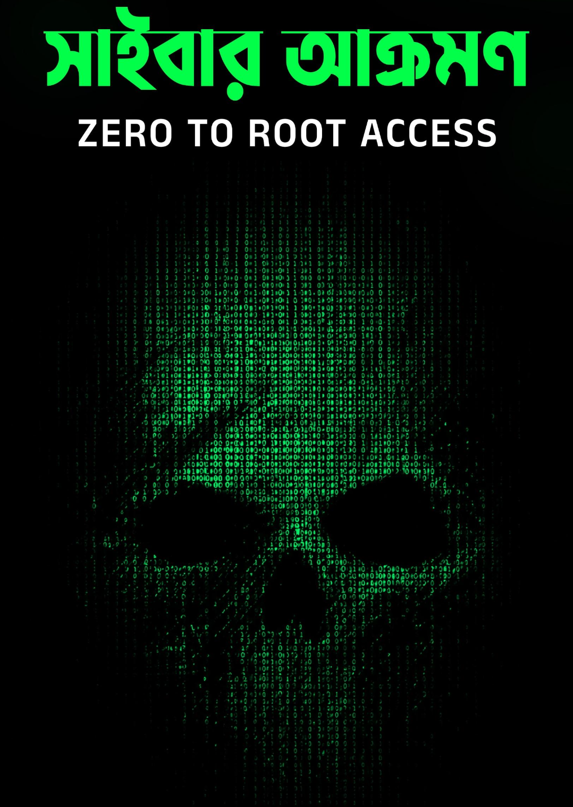

# 🔐 Zero-to-Root-Access

> Personal resources for learning — from absolute zero to root-level understanding.

  

  
  
  
  

---

## 📖 About

**Zero-to-Root-Access** is a personal, self-paced learning collection designed to build practical knowledge of systems and cybersecurity fundamentals.

The repository is organized as a structured learning path, with notes, references, and educational resources covering different areas of cybersecurity and systems.

---

## ⚠️ Ethical Use & Disclaimer

This repository is intended **strictly for educational purposes** and for practicing on systems you own or are explicitly authorized to test.

* Do **not** use anything learned here against systems, networks, or accounts without proper authorization.
* Unauthorized access to computer systems may be illegal.
* The maintainer takes no responsibility for misuse of the information provided here.

---

## 📚 Resources

For questions about the learning materials or available resources, contact:

📧 **[atia.abk@gmail.com](mailto:atia.abk@gmail.com)**

---

## 🛒 Official Book Source

If you are looking for the original book, please purchase it from an authorized source:

🔗 [Bongo IT](https://bongoit.bd/)

---

## 📄 License

This repository's original structure, notes, and content are provided for **personal educational use**.

Copyrighted third-party materials remain the property of their respective authors and publishers.
